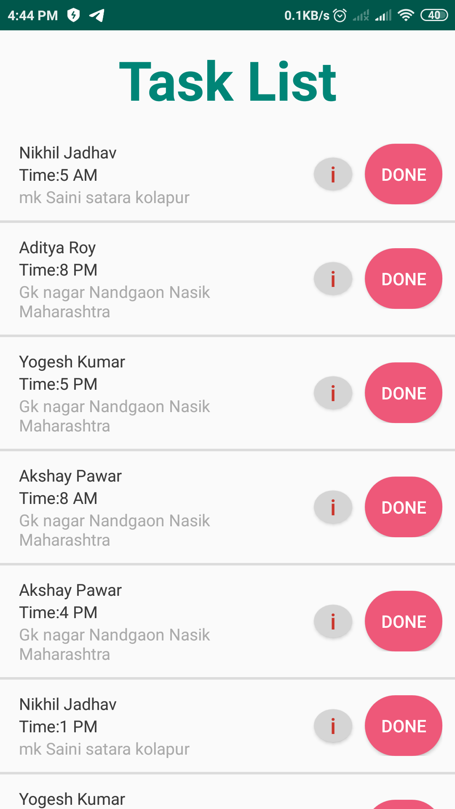
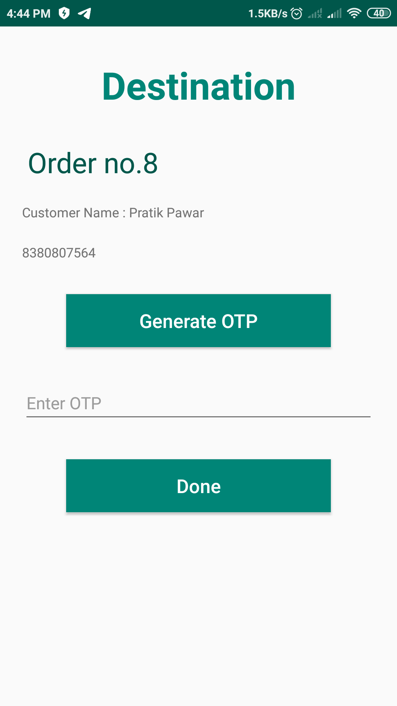

# mySTS2 
## **My Diploma Project : _SALESMAN TRACKING APP_**

- java files contain backend code of app.
- xml files contain UI or frontend code of app. 
---

### ***To track the realtime location of salesman follow steps given below :***

1. On your salesman Android phone or tablet, open the Google Maps app Maps and sign in.
1. Tap Account Circle Account Circle and 
1. then  Location sharing and 
1. then Add people: ADMIN.
1. Tap on More  and 
1. then Copy to clipboard. after that share this copied link with ADMIN.
- Admin with this link can see salesman location for as long as you choose, up to 72 hours.
---

### ****Key Features****
1) Firebase Authentication.
2) Database Operations.
3) OTP Generation.
4) Userfriendly GUI.
5) Smooth Performance.
---

## ****P R E V I E W****

         
            
      
    
---

> _KEEP SMILLING & HAPPY CODING_

